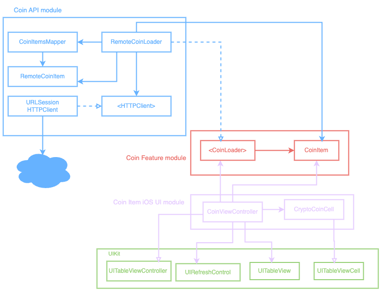

# CryptoCoin App
[](https://github.com/gtsofa/CryptoCoin/actions/workflows/CI.yml)

---
Dear reviewers,

Thank you for taking the time to review my project.

For this implementation, I followed the MVC pattern for the UI and built the app using UIKit. In the future, I plan to separate the project into multiple schemes to keep the business logic platform-agnostic. This would allow me to run tests on a macOS target for faster feedback and make the app easier to port to other platforms like SwiftUI, tvOS, or watchOS.


### How to Build and Run the App
- Clone the repo: 
	- `https://github.com/gtsofa/CryptoCoin.git`
- Navigate to the project directory
- Open the project in Xcode:
	- Run: `open Prototype/Prototype.xcodeproj/` in Terminal, 
	- Or manually double-click the `.xcodeproj` file.
- Run the project:
	- Press the Run button in Xcode,
	- Or use `Command + R`,
	- Or from the Xcode menu: `Product > Run`.

### Assumptions and Decisions:
- I assumed the 10-day duration referred to weekdays only. I should have confirmed this earlier, as I ended up rushing near the end.

- I also assumed the CoinRanking API responses were straightforward. Unfortunately, I discovered later that the coin icons were in SVG format. In hindsight, it would have been better to prototype early to catch this before diving into architecture and networking.

### Challenges & How I Handled Them:
- The coin icons were returned as SVGs, so I integrated an SVG rendering library to handle and display them correctly.

- My original goal was to build a clean, modular, and scalable architecture. However, due to time constraints, I opted to prioritize delivering the core features in a working prototype. In retrospect, I should have requested more time sooner.


Please let me know if there's anything you’d like me to clarify or improve further. Thank you again for the opportunity!

Best regards,
Julius Nyule
---


## Project Description:
Create an iOS application that fetches data from the CointRanking API and displays a list of the top 100
cryptocurrency coins paginated, showing 20 characters per page.

## Requirements

### Screen 1: Top 100 Coins List
- Display a list of all the top 100 coins, with a pagination (load 20 characters at a time).
- Each list item should include:
	- Icon
	- Name
	- Current price
	- 24 Hour performance

- Implement filtering functionality to allow the users to filter the list by highest price, and best 24-hour performance.
- Implement swipe left to favorite a coin

### Screen 2: Cryptocurrency details:
- Provide a detailed view of a selected coin displaying the following information:
	- Name
	- Performance chart/graph
	- Performance filters for the graph
	- Price
	- Other statistics

### Screen 3: Favorites Screen:
- Provide a screen that will display a list of all your favorite cryptocurrency coins.
- The user should be able to view the details of each of the favorite coins.
- The user should be able to swipe left to unfavorite a coin from the list.

## Model Specs
---

Feed Image

| Property | Type |
|----------|------|
|uuid      | UUID     |
|symbol    | String     |
|name      | String     |
|iconUrl   | URL     |
|price     | Double  |
|change    | Double  |

### Payload

```
GET /coin

200 RESPONSE

{
	"coins": [
		{
			"uuid": "a UUID",
			"symbol": " a symbol",
			"name": "a name",
			"iconUrl": "https://a-image.url"
			"price": "94219.4326"
			"change": "-1.20",
		},
		{
			"uuid": "another UUID",
			"symbol": "another symbol",
			"name": "another name"
			"iconUrl": "https://another-image.url",
			"price": "8913.526",
			"change": "2.44"
		},
		{
			"uuid": "even another UUID",
                        "symbol": even "another symbol",
                        "name": "even another name"
                        "iconUrl": "https://even another-image.url",
                        "price": "8913.526",
                        "change": "0.74"

		},
		{
			"uuid": "yet another UUID",
                        "symbol": "yet another symbol",
                        "name": "yet another name"
                        "iconUrl": "https://yet-another-image.url",
                        "price": "1030.526",
                        "change": "9.87"

		}
		...
	]
}
```

Architecture diagram




