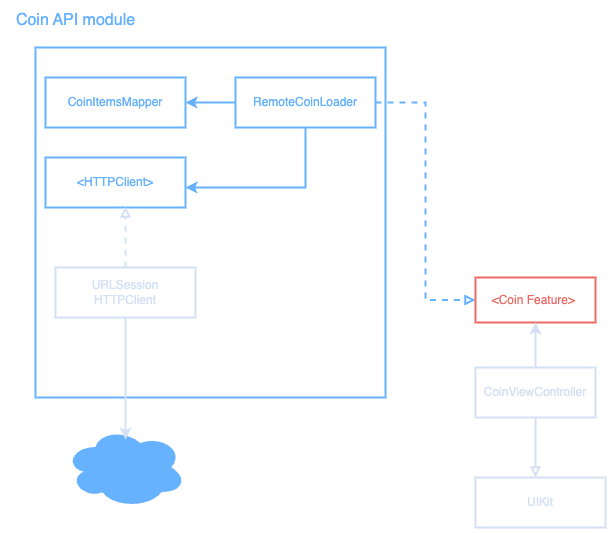

# CryptoCoin App
[](https://github.com/gtsofa/CryptoCoin/actions/workflows/CI.yml)


## Project Description:
Create an iOS application that fetches data from the CointRanking API and displays a list of the top 100
cryptocurrency coins paginated, showing 20 characters per page.

## Requirements

### Screen 1: Top 100 Coins List
- Display a list of all the top 100 coins, with a pagination (load 20 characters at a time).
- Each list item should include:
	- Icon
	- Name
	- Current price
	- 24 Hour performance

- Implement filtering functionality to allow the users to filter the list by highest price, and best 24-hour performance.
- Implement swipe left to favorite a coin

### Screen 2: Cryptocurrency details:
- Provide a detailed view of a selected coin displaying the following information:
	- Name
	- Performance chart/graph
	- Performance filters for the graph
	- Price
	- Other statistics

### Screen 3: Favorites Screen:
- Provide a screen that will display a list of all your favorite cryptocurrency coins.
- The user should be able to view the details of each of the favorite coins.
- The user should be able to swipe left to unfavorite a coin from the list.

## Model Specs
---

Feed Image

| Property | Type |
|----------|------|
|uuid      | UUID     |
|symbol    | String     |
|name      | String     |
|iconUrl   | URL     |
|price     | Double  |
|change    | Double  |

### Payload

```
GET /coin

200 RESPONSE

{
	"coins": [
		{
			"uuid": "a UUID",
			"symbol": " a symbol",
			"name": "a name",
			"iconUrl": "https://a-image.url"
			"price": "94219.4326"
			"change": "-1.20",
		},
		{
			"uuid": "another UUID",
			"symbol": "another symbol",
			"name": "another name"
			"iconUrl": "https://another-image.url",
			"price": "8913.526",
			"change": "2.44"
		},
		{
			"uuid": "even another UUID",
                        "symbol": even "another symbol",
                        "name": "even another name"
                        "iconUrl": "https://even another-image.url",
                        "price": "8913.526",
                        "change": "0.74"

		},
		{
			"uuid": "yet another UUID",
                        "symbol": "yet another symbol",
                        "name": "yet another name"
                        "iconUrl": "https://yet-another-image.url",
                        "price": "1030.526",
                        "change": "9.87"

		}
		...
	]
}
```

Architecture diagram




